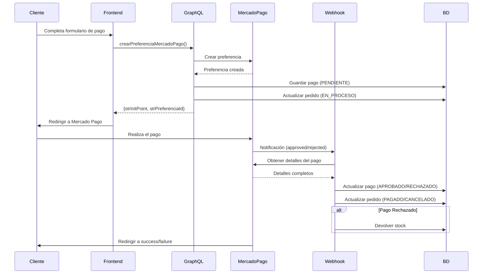

# 🚀 Implementación de Mercado Pago - Webhook y Resolvers

## ✅ **Archivos Creados/Modificados:**

### 1. **Resolver de MercadoPago** (`src/app/api/graphql/resolvers.ts`)
- ✅ `crearPreferenciaMercadoPago`: Crea preferencia de pago y registra en BD
- ✅ `actualizarEstadoPago`: Actualiza estado del pago desde webhook

### 2. **Webhook** (`src/app/api/webhook/mercadopago/route.ts`)
- ✅ Endpoint POST para recibir notificaciones de Mercado Pago
- ✅ Actualización automática de estados de pago y pedido
- ✅ Devolución automática de stock en caso de rechazo/cancelación
- ✅ Endpoint GET para verificar que el webhook está activo

### 3. **Variables de Entorno** (`.env`)
- ✅ URLs de frontend y backend configuradas

---

## 📋 **Uso de las Mutaciones**

### 1️⃣ Crear Preferencia de Mercado Pago

```graphql
mutation CrearPreferenciaMercadoPago {
  crearPreferenciaMercadoPago(
    data: {
      intPedido: 1
      intCliente: 1
      intDireccion: 1
      formData: {
        nombre: "Juan Pérez"
        apellido: "García"
        email: "juan@email.com"
        telefono: "4421234567"
        calle: "Av. Juárez"
        numeroExterior: "456"
        colonia: "Centro"
        ciudad: "Celaya"
        estado: "Guanajuato"
        codigoPostal: "38000"
        metodoEnvio: "express"
        metodoPago: "tarjeta"
        mesesSinIntereses: "6"
      }
      montos: {
        subtotal: 1299.00
        costoEnvio: 150.00
        total: 1449.00
      }
      items: [
        {
          id: "1"
          title: "MacBook Air M2"
          description: "Laptop Apple MacBook Air con chip M2"
          picture_url: "https://..."
          category_id: "electronics"
          quantity: 1
          unit_price: 1299.00
        }
      ]
      payer: {
        name: "Juan"
        surname: "Pérez"
        email: "juan@email.com"
        phone: {
          number: "4421234567"
        }
        address: {
          zip_code: "38000"
          street_name: "Av. Juárez"
          street_number: "456"
        }
      }
      shipments: {
        cost: 150.00
        mode: "express"
        receiver_address: {
          zip_code: "38000"
          street_name: "Av. Juárez"
          street_number: "456"
          city_name: "Celaya"
          state_name: "Guanajuato"
          country_name: "México"
        }
      }
      metadata: {
        meses_sin_intereses: 12
      }
    }
  ) {
    intPago
    strPreferenciaId
    strInitPoint
    strEstado
  }
}
```

**Respuesta:**
```json
{
  "data": {
    "crearPreferenciaMercadoPago": {
      "intPago": 1,
      "strPreferenciaId": "123456789-abcd-efgh-ijkl-123456789012",
      "strInitPoint": "https://www.mercadopago.com.mx/checkout/v1/redirect?pref_id=...",
      "strEstado": "PENDIENTE"
    }
  }
}
```

---

### 2️⃣ Actualizar Estado de Pago (Webhook)

Esta mutación es llamada automáticamente por el webhook, pero también puedes usarla manualmente:

```graphql
mutation ActualizarEstadoPago {
  actualizarEstadoPago(
    strMercadoPagoId: "12345678901"
    strEstado: "approved"
    jsonRespuesta: "{\"id\":12345678901,\"status\":\"approved\"}"
  ) {
    intPago
    strMercadoPagoId
    strEstado
    tbPedido {
      intPedido
      strEstado
    }
  }
}
```

---

## 🔄 **Flujo Completo del Pago**



---

## 🌐 **Configurar Webhook en Mercado Pago**

1. Ve a: https://www.mercadopago.com.mx/developers/panel/webhooks
2. Haz clic en "Crear webhook"
3. Configuración:
   - **URL**: `https://tu-dominio.com/api/webhook/mercadopago`
   - **Eventos**: Selecciona "Pagos"
   - **Versión**: v1 (latest)

### Para desarrollo local (usando ngrok):

```bash
# Instalar ngrok
npm install -g ngrok

# Exponer tu servidor local
ngrok http 3000

# Usar la URL generada en el webhook
# Ejemplo: https://abc123.ngrok.io/api/webhook/mercadopago
```

---

## 🧪 **Testing del Webhook**

### Verificar que el webhook está activo:

```bash
curl http://localhost:3000/api/webhook/mercadopago
```

Respuesta:
```json
{
  "status": "active",
  "message": "Webhook de Mercado Pago está activo",
  "timestamp": "2025-11-26T20:00:00.000Z"
}
```

### Simular notificación de pago:

```bash
curl -X POST http://localhost:3000/api/webhook/mercadopago \
  -H "Content-Type: application/json" \
  -d '{
    "type": "payment",
    "action": "payment.updated",
    "data": {
      "id": "12345678901"
    }
  }'
```

---

## 📊 **Estados del Pago y Pedido**

| Estado MP | Estado Pago BD | Estado Pedido | Acción |
|-----------|----------------|---------------|--------|
| `approved` | APROBADO | PAGADO | ✅ Continuar proceso |
| `pending` | PENDIENTE | EN_PROCESO | ⏳ Esperar confirmación |
| `in_process` | PENDIENTE | EN_PROCESO | ⏳ Procesando |
| `rejected` | RECHAZADO | CANCELADO | 🔄 Devolver stock |
| `cancelled` | CANCELADO | CANCELADO | 🔄 Devolver stock |
| `refunded` | REEMBOLSADO | CANCELADO | 🔄 Devolver stock |

---

## ⚠️ **Notas Importantes**

### 1. **Seguridad del Webhook**
- El webhook está público y puede recibir notificaciones de cualquier origen
- Para producción, agrega verificación de firma de Mercado Pago:

```typescript
// Verificar firma x-signature
const signature = request.headers.get('x-signature');
const requestId = request.headers.get('x-request-id');
// Validar con tu secret de MP
```

### 2. **Manejo de Duplicados**
- El webhook puede recibir la misma notificación múltiples veces
- La implementación actual maneja esto buscando el pago existente

### 3. **Timeout**
- Mercado Pago espera respuesta en < 5 segundos
- Si el webhook tarda más, MP lo reintentará

### 4. **Logs**
- Todos los eventos se registran en consola con emojis para fácil identificación
- En producción, considera usar un servicio de logging (Sentry, LogRocket, etc.)

### 5. **Devolución de Stock**
- Se devuelve automáticamente si el pago es rechazado, cancelado o reembolsado
- Esto se hace dentro de una transacción para garantizar consistencia

---

## 🔧 **Configuración en Producción**

1. **Variables de Entorno**:
```env
MERCADOPAGO_ACCESS_TOKEN=tu_token_de_produccion
FRONTEND_URL=https://tu-dominio.com
BACKEND_URL=https://tu-api.com
```

2. **URLs de Webhook**:
- Configura en el panel de Mercado Pago
- Debe ser HTTPS obligatorio

3. **Certificado SSL**:
- Mercado Pago solo acepta webhooks HTTPS
- Usa Let's Encrypt, Cloudflare o similar

---

## 📞 **Soporte**

Si tienes problemas:

1. **Revisa los logs del servidor**: Los emojis te ayudarán a identificar el problema
2. **Verifica las credenciales**: Asegúrate de usar las correctas (test/producción)
3. **Prueba el webhook manualmente**: Usa curl para simular notificaciones
4. **Revisa el panel de Mercado Pago**: Ve el historial de webhooks enviados

---

## ✅ **Checklist de Implementación**

- [x] SDK de Mercado Pago instalado
- [x] Resolvers de GraphQL implementados
- [x] Webhook creado y funcionando
- [x] Variables de entorno configuradas
- [x] Devolución automática de stock
- [x] Actualización de estados
- [ ] Webhook configurado en panel de MP
- [ ] Certificado SSL en producción
- [ ] Testing con tarjetas de prueba
- [ ] Monitoreo de logs implementado
